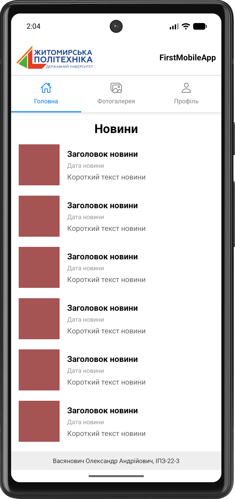
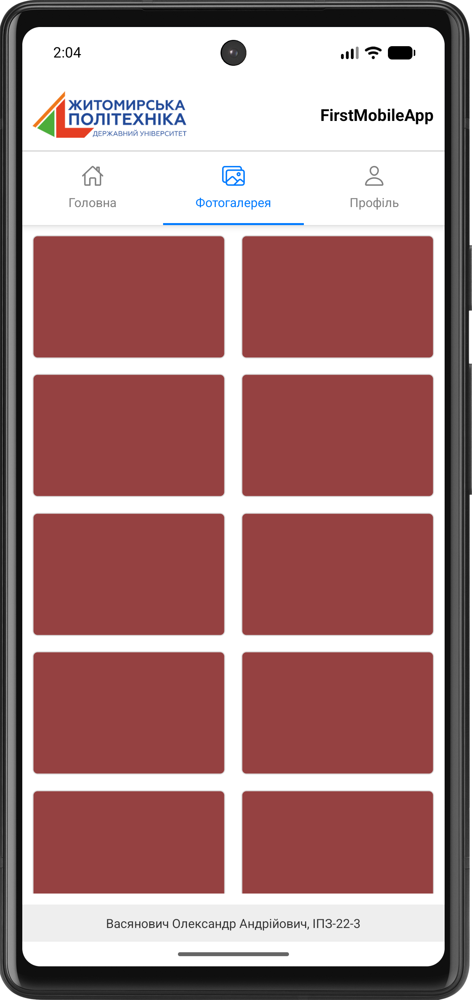
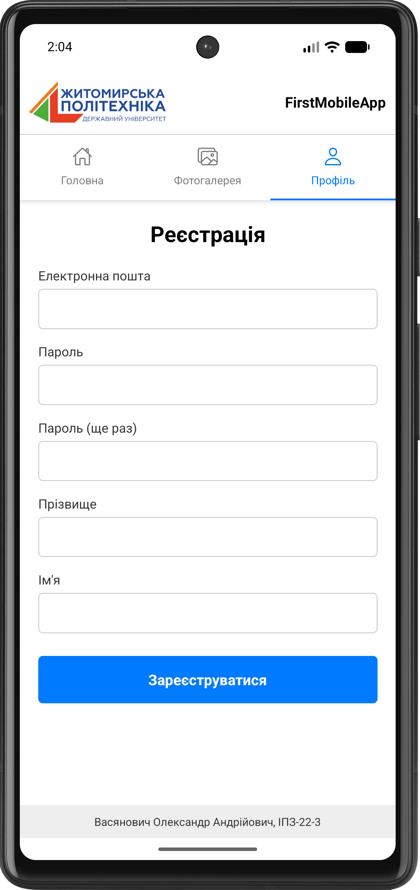

# Лабораторна робота №1. Використання Expo для створення найпростішого додатку React Native

## Опис проєкту
Простий мобільний застосунок, створений за допомогою Expo та React Native. Проєкт демонструє роботу з базовими компонентами (View, Text, TextInput, FlatList), стилізацію за допомогою StyleSheet та налаштування навігації між трьома екранами за допомогою `@react-navigation/material-top-tabs`.

## Інструкція із запуску

1. Переконайтеся, що у вас встановлено Node.js.
2. Перейдіть до директорії проєкту: `cd lab1`
3. Встановіть залежності: `npm install`
4. Запустіть сервер Expo: `npx expo start`

## Способи запуску мобільного додатка

* **Expo Go (Фізичний пристрій):** Встановіть додаток Expo Go на свій смартфон. Відскануйте QR-код з терміналу. Цей спосіб найшвидший для тестування на реальному залізі без підключення кабелів. Обмеження: не підтримує нативні модулі, які не входять до складу Expo SDK.
* **Android Emulator:** Вимагає встановленого Android Studio та налаштованого Virtual Device. Після запуску `npx expo start`, натисніть `a` у терміналі. Дозволяє тестувати додаток на різних версіях Android та роздільних здатностях екрану без фізичного пристрою.
* **Web-версія:** Натисніть `w` у терміналі після запуску. Зручно для швидкої перевірки верстки, але не відображає специфічну поведінку мобільних платформ.
## Скріншоти

