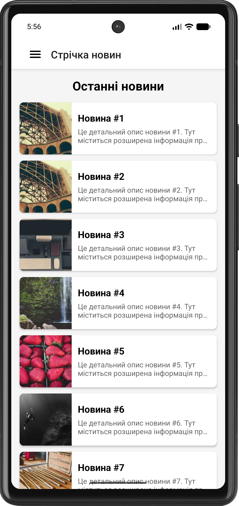
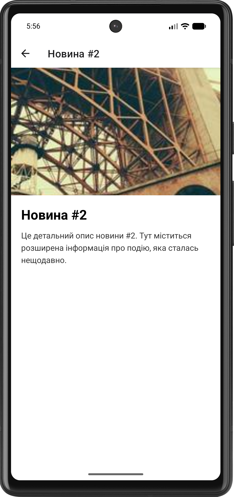
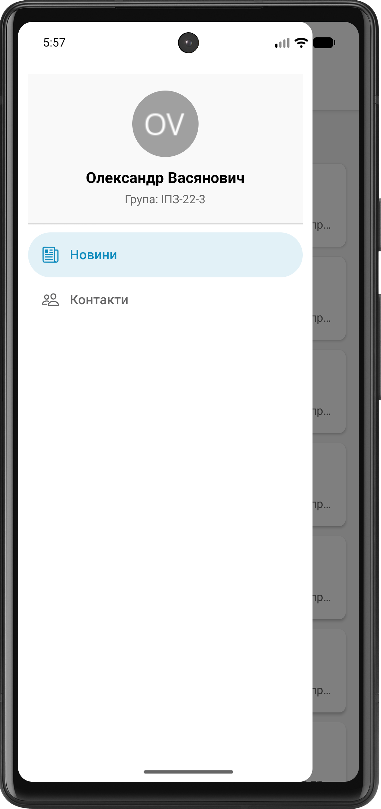
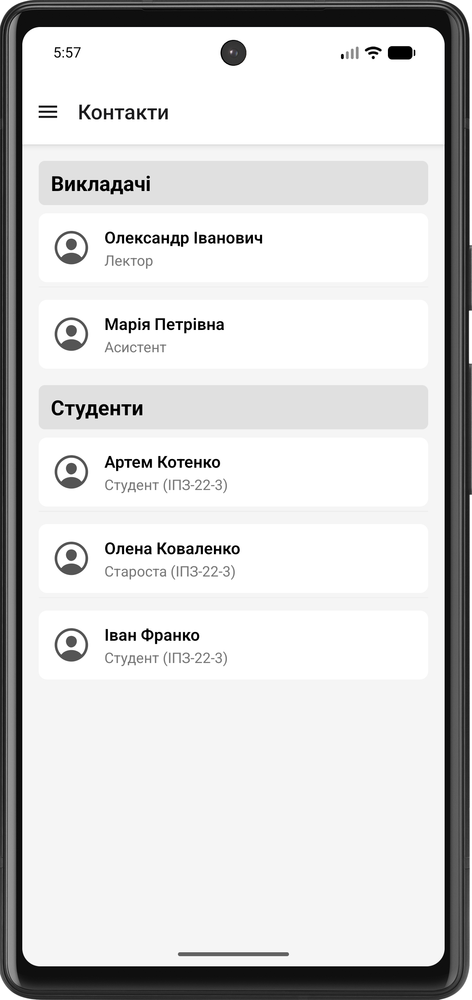

# Лабораторна робота №2. Побудова вкладеної навігації та оптимізація відображення великих списків

## Інструкція запуску
1. Перейдіть до папки: `cd lab2`
2. Встановіть залежності: `npm install`
3. Запустіть проєкт: `npx expo start`

## Опис реалізованого функціоналу
- Налаштовано вкладену навігацію: Drawer Navigator містить Stack Navigator (для новин) та окремий екран (для контактів).
- Створено кастомне бокове меню (`CustomDrawer`) з відображенням аватару, ПІБ та групи студента.
- Усунуто подвійний header шляхом `headerShown: false` для Drawer.Screen, який містить Stack.
- Реалізовано динамічний заголовок в `DetailsScreen` на основі переданих параметрів (`route.params`).
- Екран новин використовує `FlatList` з віртуалізацією (`initialNumToRender`, `maxToRenderPerBatch`, `windowSize`), Pull-to-Refresh та Infinite Scroll (імітація завантаження через setTimeout).
- Екран контактів використовує `SectionList` для групування даних за категоріями.

## Скріншоти роботи застосунку

## Висновки (Відповіді на контрольні запитання)
1. **Чим відрізняється FlatList від ScrollView?**
   ScrollView рендерить усі дочірні елементи одразу, що витрачає багато пам'яті для великих списків. FlatList використовує віртуалізацію і рендерить лише ті елементи, які зараз знаходяться в області видимості екрана (або близько до неї), видаляючи з пам'яті ті, що залишилися поза нею.
2. **Що таке віртуалізація списків?**
   Це механізм оптимізації, за якого в ієрархії нативних компонентів рендеряться лише видимі елементи. Під час прокручування елементи перевикористовуються, що зменшує навантаження на пам’ять і процесор.
3. **Як здійснюється передача параметрів між екранами?**
   Через об'єкт `navigation`. Під час виклику методу навігації передається другий аргумент-об'єкт: `navigation.navigate('RouteName', { key: 'value' })`. На цільовому екрані ці дані зчитуються через `route.params.key`.
4. **Що таке вкладена навігація?**
   Це архітектурний підхід, коли один навігатор (наприклад, Stack Navigator) стає екраном (дочірнім компонентом) всередині іншого навігатора (наприклад, Drawer Navigator).
5. **У яких випадках застосовується SectionList?**
   Коли масив даних логічно поділений на групи (категорії), і кожна група потребує власного заголовка (наприклад, контакти за алфавітом, розклад за днями тижня, налаштування за секціями).