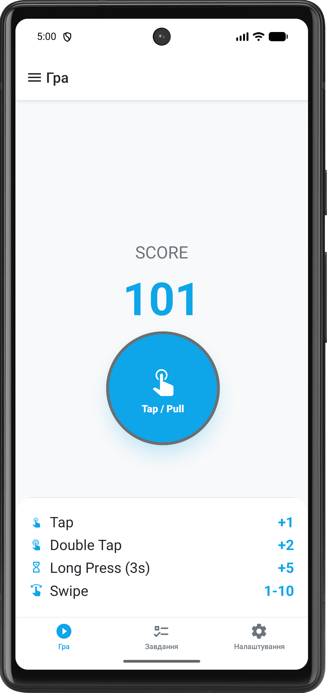
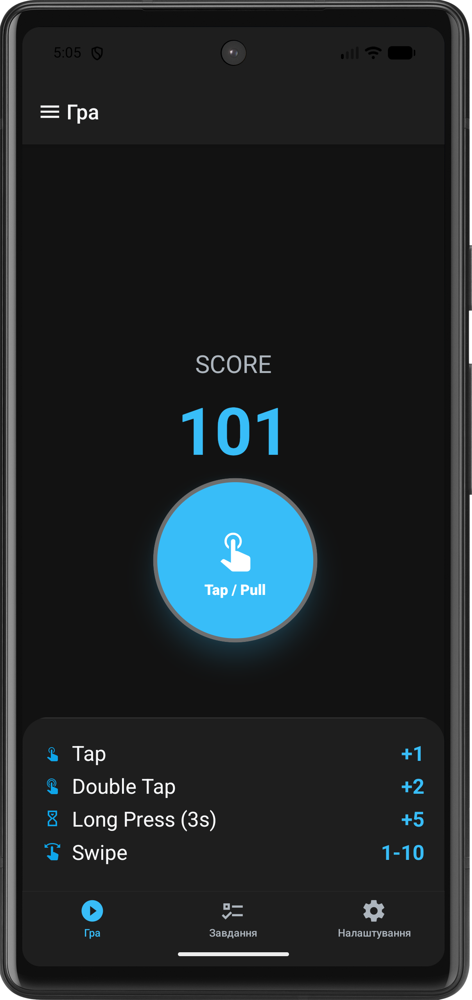
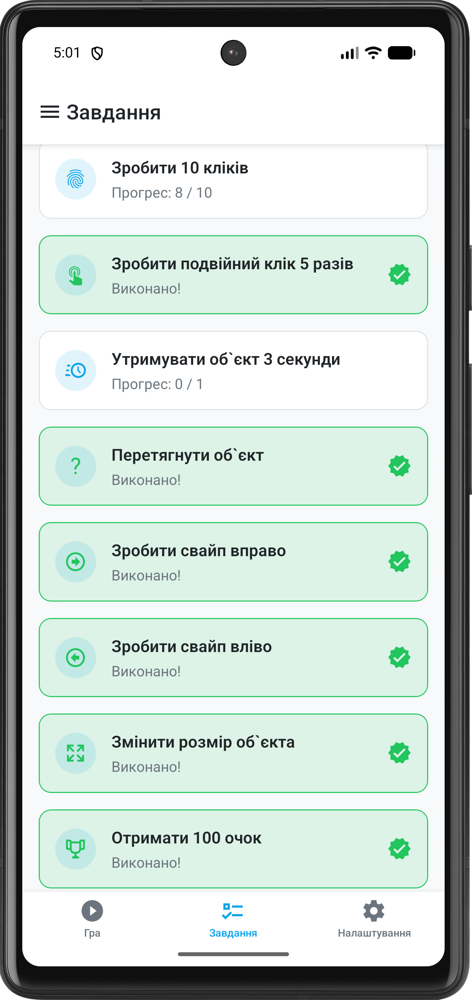
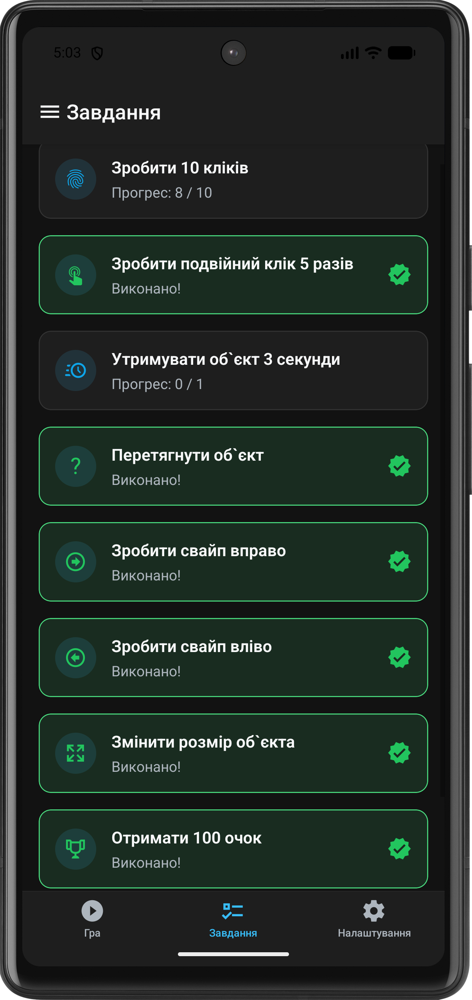
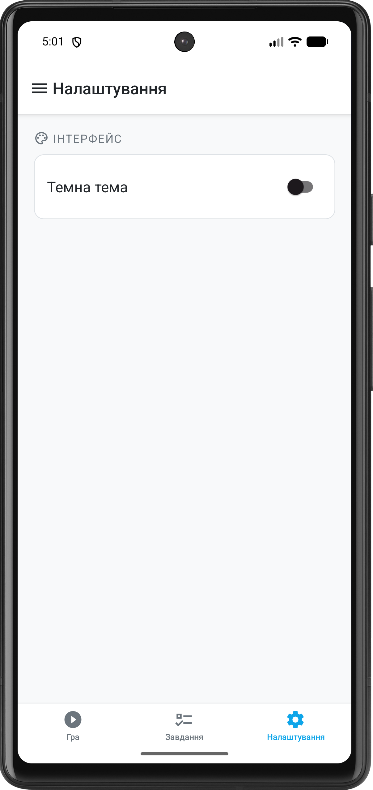
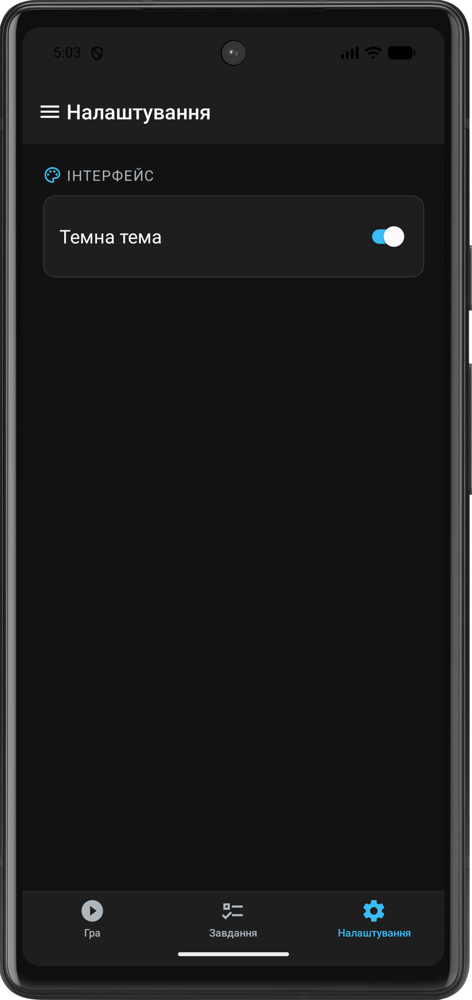

# Лабораторна робота №3. Жести та стилізація

## Опис функціоналу

Додаток являє собою інтерактивний ігровий клікер, де взаємодія з об'єктом відбувається через жести:

- **Tap**: Клік +1 бал.
- **Double Tap**: Подвійний клік +2 бали.
- **Long Press (3s)**: Утримування 3с +5 балів.
- **Pan**: Перетягування об'єкта по екрану.
- **Fling (Left/Right)**: Свайпи, випадкова кількість балів (1-10).
- **Pinch**: Зміна масштабу об'єкта.

Реалізовано систему завдань, що відстежує активність користувача, та підтримку темної теми.

## Інструкція запуску

1. Перейти в папку: `cd lab3`
2. Встановити залежності: `npm install`
3. Запустити проєкт: `npx expo start`

Після цього можна:

- натиснути `a` для запуску на Android емуляторі
- відсканувати QR-код у Expo Go на телефоні
- натиснути `w` для перегляду у браузері

## Висновки

У ході виконання лабораторної роботи було опановано роботу з сучасним API жестів у React Native за допомогою
бібліотеки `react-native-gesture-handler`. Було реалізовано складну логіку одночасної обробки різних жестів (`Exclusive`
та `Simultaneous` композиції) на одному об'єкті.

Особливу увагу приділено візуальній частині: за допомогою `react-native-reanimated` створено плавні анімації відгуку
об'єкта на дотики, а бібліотека `styled-components` дозволила реалізувати гнучку систему тем. Також було закріплено
навички роботи з `React Context` для глобального управління станом застосунку (рахунок, статус завдань, налаштування
інтерфейсу), що забезпечило синхронізацію даних між різними екранами навігації.

## Скріншоти роботи застосунку

1. Головний екран (Game Screen) з клікером та легендою балів.

   
   
   
2. Екран завдань (Challenges) з відмітками про виконання.

   
   
   
3. Екран налаштувань (Settings) з перемикачем теми.

   
   
