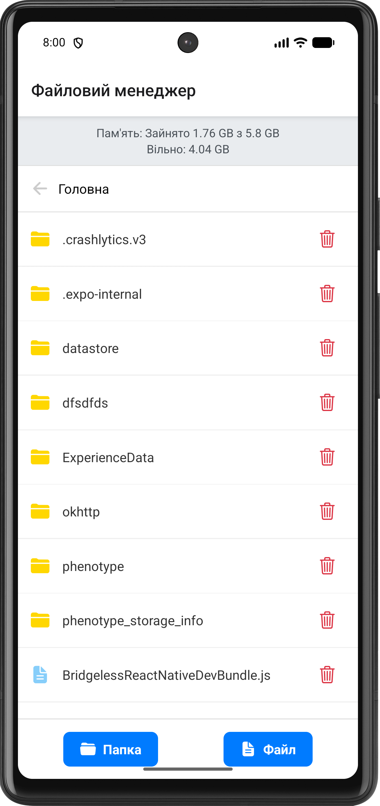
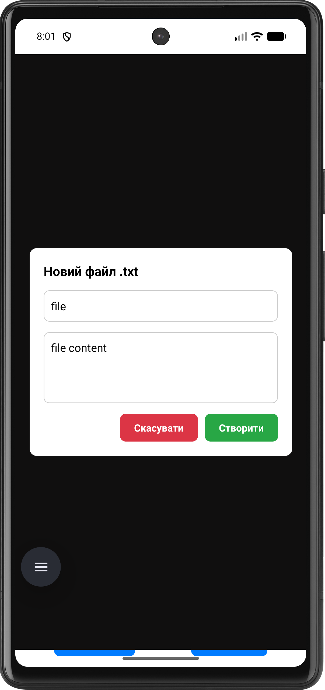
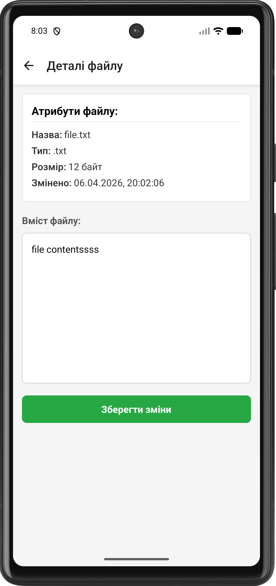
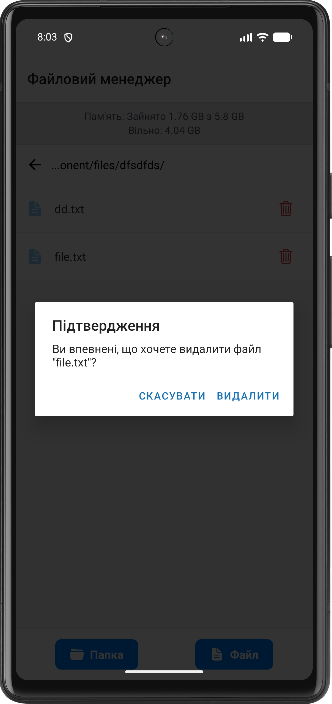

# Лабораторна робота №4. Робота з файловою системою

## Опис функціоналу

Додаток реалізує функції локального файлового менеджера

Основні можливості:
- Навігація файловою системою: відображення списку файлів і папок, перехід у вкладені директорії, механізм повернення "вгору", відображення поточного шляху.
- Створення нових папок та текстових файлів.
- Перегляд детальної інформації об'єкта: назва, розширення, розмір та дата останньої модифікації.
- Зчитування та редагування вмісту текстових файлів.
- Видалення файлів та папок з обов'язковим підтвердженням дії.
- Виведення статистики використання пам'яті пристрою (загальний, зайнятий та вільний простір).

## Інструкція запуску

1. Перейти в папку: `cd lab4`
2. Встановити залежності: `npm install`
3. Запустити проєкт: `npx expo start`

Після цього можна:

- натиснути `a` для запуску на Android емуляторі
- відсканувати QR-код у Expo Go на телефоні
- натиснути `w` для перегляду у браузері

## Скріншоти роботи застосунку

1. Головний екран (Home Screen) із навігацією, статистикою пам'яті, списком файлів та папок

   

2. Модальне вікно створення нового файлу/папки

   

3. Екран деталей файлу (File Detail Screen) з детальною інформацією та полем для редагування тексту

   

4. Діалогове вікно підтвердження видалення об'єкта

   