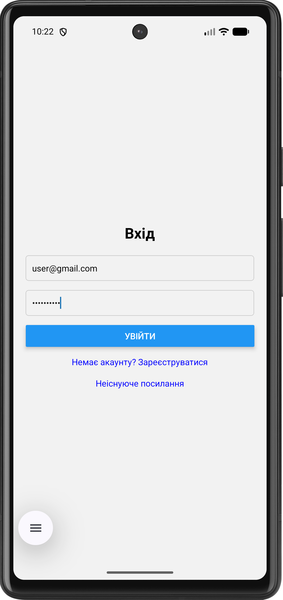
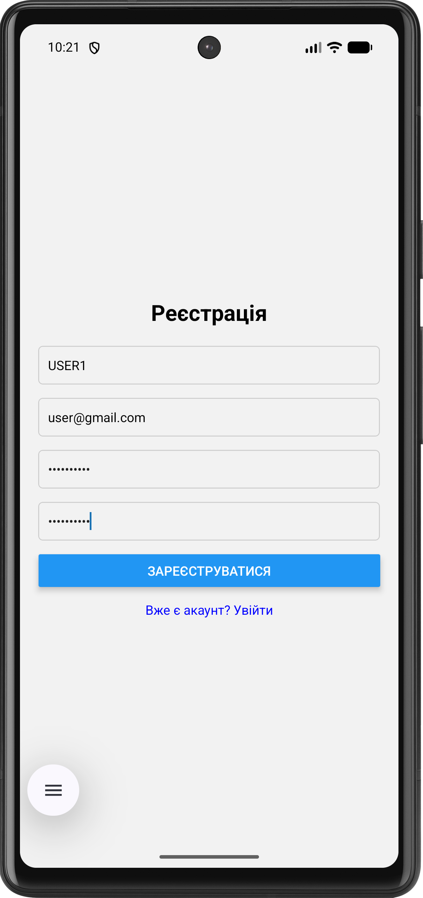
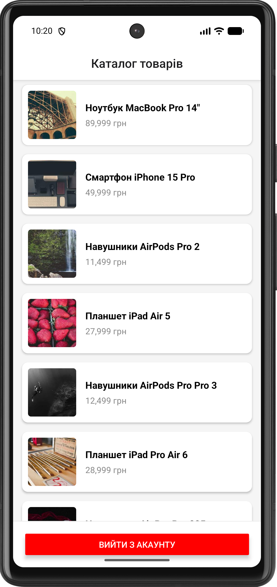
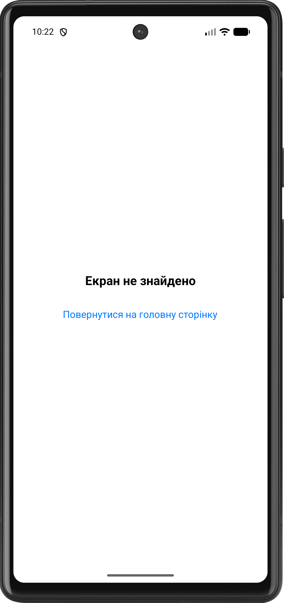

# Лабораторна робота №5: Навігація в React Native (Expo Router)

## 1. Інструкція із запуску

1. Клонувати репозиторій.
2. Встановити залежності: `npm install`.
3. Запустити сервер розробки: `npx expo start`.

### Способи запуску мобільного додатка

* **Expo Go (Фізичний пристрій):** Встановіть додаток Expo Go на свій смартфон. Відскануйте QR-код з терміналу. Цей
  спосіб найшвидший для тестування на реальному залізі без підключення кабелів. Обмеження: не підтримує нативні модулі,
  які не входять до складу Expo SDK.
* **Android Emulator:** Вимагає встановленого Android Studio та налаштованого Virtual Device. Після
  запуску `npx expo start`, натисніть `a` у терміналі. Дозволяє тестувати додаток на різних версіях Android та
  роздільних здатностях екрану без фізичного пристрою.
* **Web-версія:** Натисніть `w` у терміналі після запуску. Зручно для швидкої перевірки верстки, але не відображає
  специфічну поведінку мобільних платформ.

## 2. Опис функціоналу

- **Auth Context**: Глобальне керування станом авторизації (login, register, logout).
- **Protected Routes**: Група `(app)` доступна лише авторизованим користувачам; автоматичне перенаправлення
  неавторизованих у групу `(auth)`.
- **Каталог товарів**: Відображення списку об'єктів за допомогою `FlatList` з кастомними картками.
- **Динамічна навігація**: Екран деталей товару з отриманням параметрів через `useLocalSearchParams`.
- **Error Handling**: Обробка неіснуючих маршрутів через `+not-found`.

## 3. Скріншоти роботи

- **Екран входу**:
  
- **Екран реєстрації**:
  
- **Каталог товарів**:
  
- **Деталі товару**:
  
- **Помилка 404**:
  

## 4. Висновки (Відповіді на контрольні запитання)

1. **Перенаправлення**: Реалізується перевіркою стану в `_layout.jsx` відповідної групи.
   Якщо `isAuthenticated === false`, компонент повертає `<Redirect href="/login" />`.
2. **Link та router.push()**: `<Link>` - декларативний компонент (краще для доступності та SEO на
   web), `router.push()` - метод для програмного переходу (наприклад, після виклику функції).
3. **Динамічні маршрути**: Створюються за допомогою файлів із назвою в квадратних дужках, наприклад `[id].jsx`.
   Параметри отримуються через хук `useLocalSearchParams()`.
4. **React Context**: Дозволяє уникнути "prop drilling" та забезпечує синхронний доступ до стану авторизації з
   будь-якого рівня вкладеності екранів та макетів.
5. **Групи маршрутів**: Використовуються для логічного групування файлів (наприклад, `(auth)` та `(app)`). Вони не
   впливають на URL-адресу, дозволяють створювати окремі макети (`_layout.jsx`) для різних частин додатку.