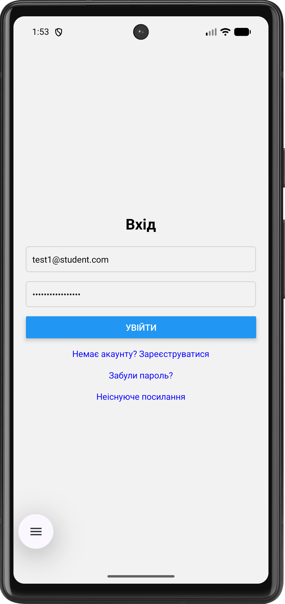
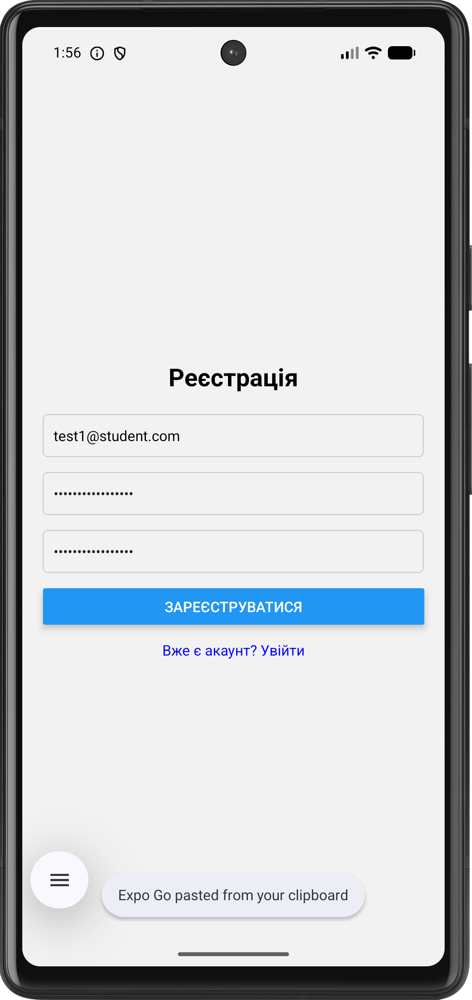
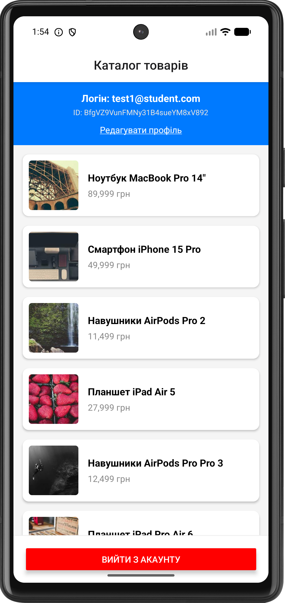
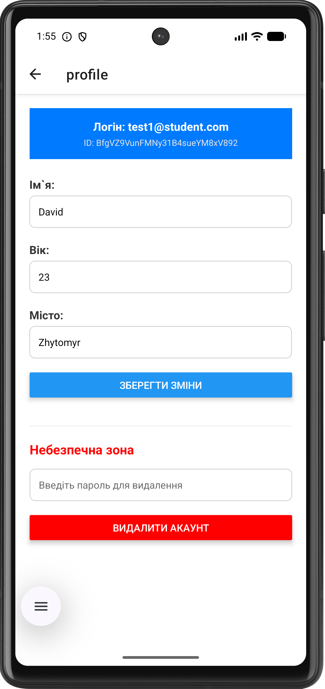
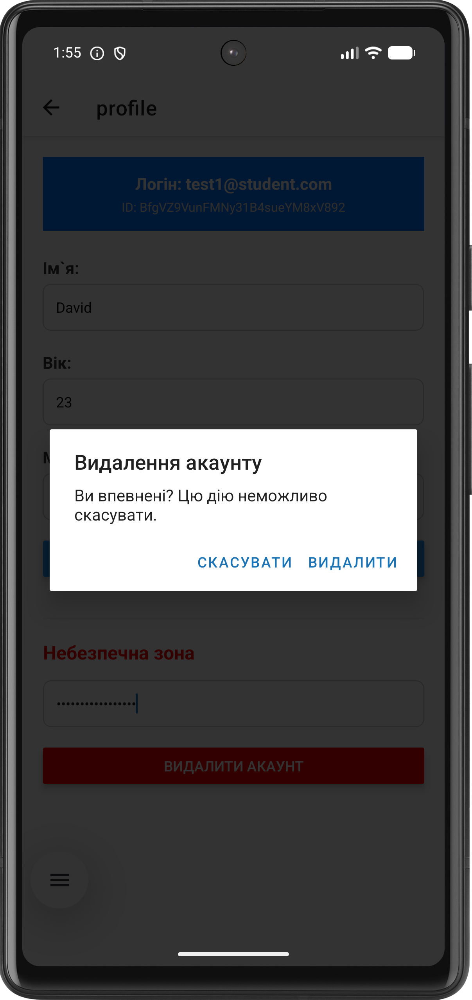

# Лабораторна робота №6: Авторизація та Firestore в React Native

## 1. Інструкція із запуску

1. Клонувати репозиторій.
2. Встановити залежності: `npm install`.
3. Запустити сервер розробки: `npx expo start`.

### Способи запуску мобільного додатка

* **Expo Go (Фізичний пристрій):** Встановіть додаток Expo Go на свій смартфон. Відскануйте QR-код з терміналу. Цей
  спосіб найшвидший для тестування на реальному залізі без підключення кабелів. Обмеження: не підтримує нативні модулі,
  які не входять до складу Expo SDK.
* **Android Emulator:** Вимагає встановленого Android Studio та налаштованого Virtual Device. Після
  запуску `npx expo start`, натисніть `a` у терміналі. Дозволяє тестувати додаток на різних версіях Android та
  роздільних здатностях екрану без фізичного пристрою.
* **Web-версія:** Натисніть `w` у терміналі після запуску. Зручно для швидкої перевірки верстки, але не відображає
  специфічну поведінку мобільних платформ.

## 2. Опис функціоналу

- **Firebase Authentication**: реалізовано реєстрацію, вхід та вихід із системи.
- **Відновлення паролю**: інтегровано `sendPasswordResetEmail` для скидання через email.
- **Firestore Integration**: автоматичне створення документа користувача в колекції `users` при реєстрації.
- **Profile Management**: екран профілю для перегляду та редагування персональних даних (ім'я, вік, місто).
- **Security & Validation**:
    - Клієнтська валідація `uid` перед кожним запитом.
    - Налаштовані Firestore Security Rules для захисту даних на рівні сервера.
- **Account Deletion**: безпечне видалення акаунту з обов'язковою повторною автентифікацією (re-authentication).

## 3. Скріншоти роботи
- **Екран входу**:
  
- **Екран реєстрації**:
  
- **Каталог (Авторизований)**:
  
- **Профіль користувача**:
  
- **Видалення акаунту**:
  

## 4. Висновки

Під час виконання лабораторної роботи було успішно реалізовано мобільний застосунок із повноцінною системою авторизації та збереженням персональних даних.
Набуто комплексних практичних навичок побудови безпечних, орієнтованих на користувача мобільних додатків з використанням сучасних хмарних рішень Firebase.